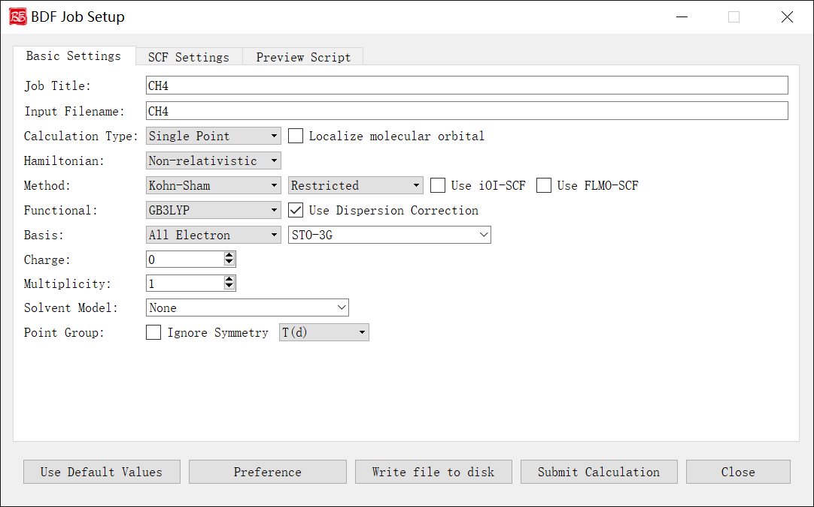
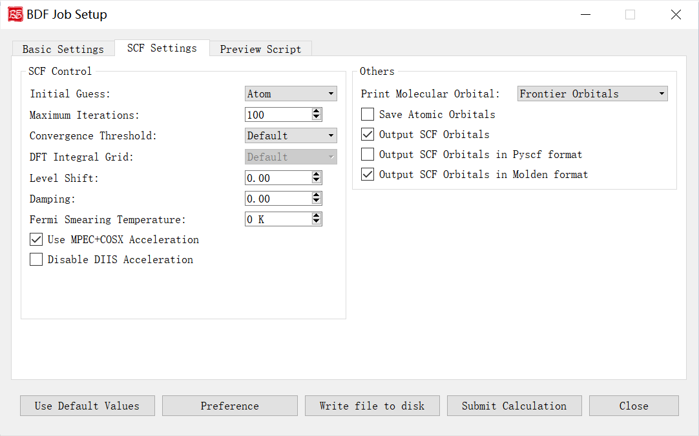
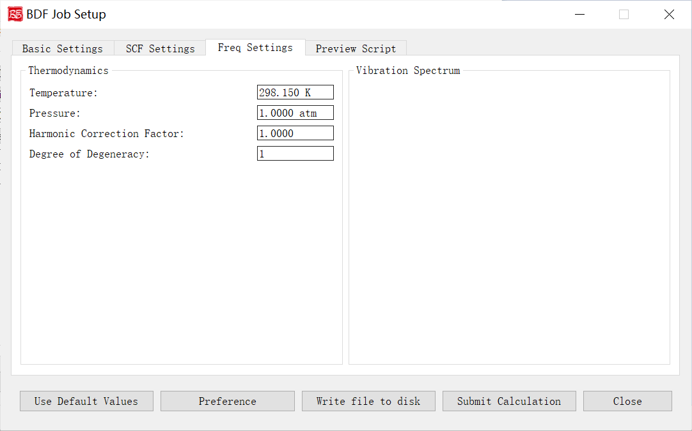
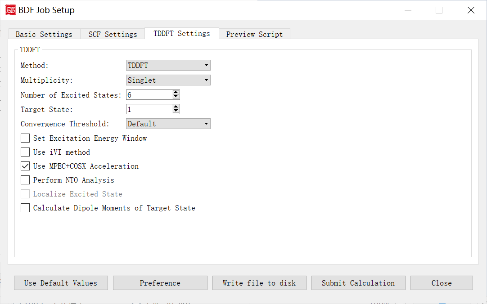
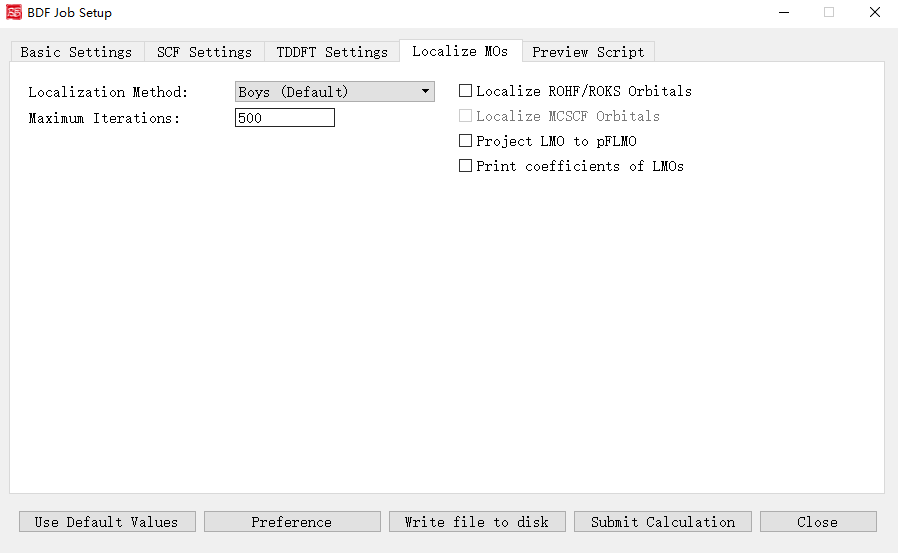
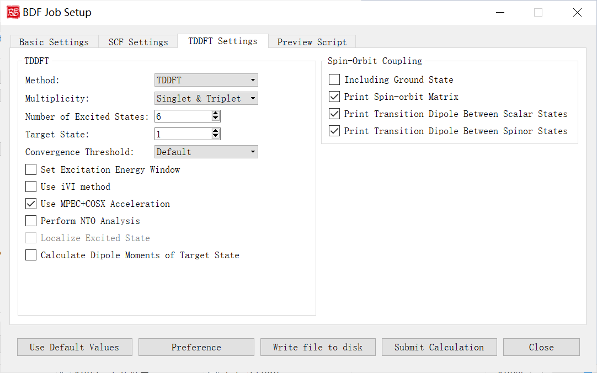
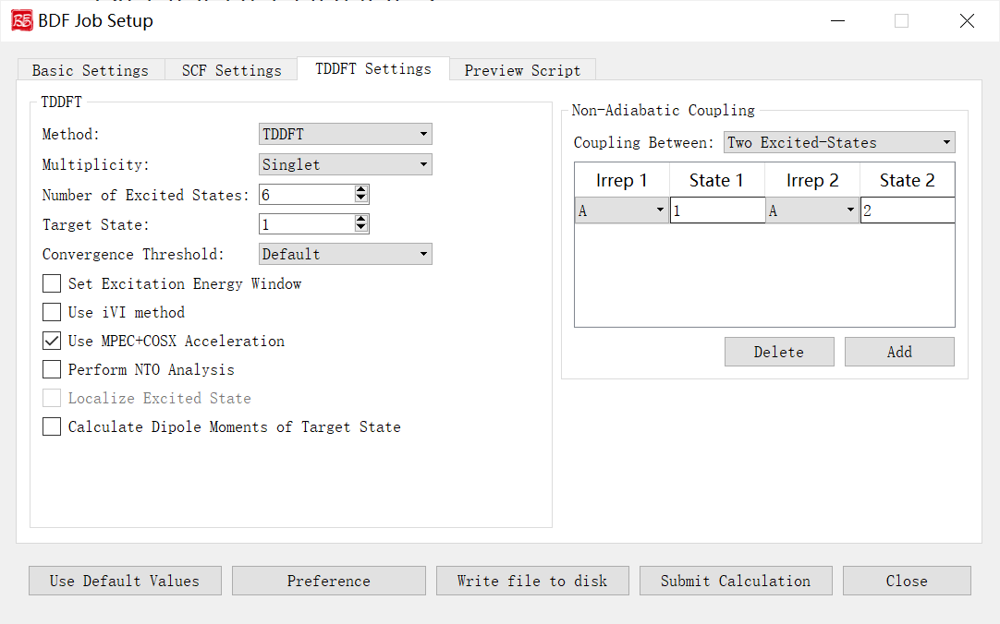

.. _run-bdfgui:

图形界面
************************************

本章将介绍BDF图形界面的功能和使用的注意事项。

初始参数界面
================================================

上图是启动BDF任务提交界面的初始参数界面，这儿我们以甲烷分子 :math:`\ce{CH4}` 作为计算对象。

当我们导入分子结构之后，程序首先会识别分子的化学式、电荷数、对称点群等信息。并且根据这些信息来完成一些默认的设置，如Job Title输入框的内容、Input Filename的输入框内容、Multiplicity的输入框内容、Point Group的下拉框选项等。

下面我们对上图的图形界面的控件及其功能一一说明：

1. Job Title：计算任务的标题说明，一般用于备注当前计算的任务类型、分子体系和参数等等。这部分内容并不影响BDF的计算，但是为了养成良好的习惯，也方便将来查询，用户可根据自己的习惯进行一定的备注。例如对于单点能计算，笔者习惯将其备注成 ``SP_CH4_B3LYP-D3/6-31g**`` 。

2. Input Filename：计算任务的文件名，该输入框限制只能输入数字、字母、下划线（_）、加号（+）和减号（-）。例如当前输入为 ``CH4`` ，则软件会自动保存输入文件为 ``CH4.inp`` 。

3. Calculation Type：计算任务的类型，当前的图形界面支持 **Single Point（单点能计算）**、 **Optimization（结构优化）**、 **Frequency（频率计算）**、 **Opt+Freq（结构优化+频率计算）**、 **TDDFT（激发态计算）**、 **TDDFT-SOC（自旋轨道耦合计算）**、 **TDDFT-NAC（非绝热耦合计算）**、 **TDDFT-OPT（激发态结构优化）**、 **TDDFT-Freq（激发态频率计算）**、 **TDDFT-OPT+Freq（激发态结构优化+频率计算）**、 **NMR（核磁共振）** 共计11种计算类型。 **Localize molecular orbital** 复选框表示设置分子轨道局域化参数。每一种计算类型都有相关的设置参数，选择对应的计算任务类型之后，程序会激活相应的控制模块。

4. Hamiltonian：计算任务考虑相对论效应时采用的哈密顿量，BDF支持多种相对论效应的计算，具体细节参见 :doc:`Introduction`，考虑到大部分用户的使用习惯和理论基础，当前的图形界面只提供了 **Non-relativistic（非相对论）**， **ECP（赝势）**， **sf-X2C** 和 **X2C** 四种选项。其中 **X2C** 尚未在当前发布的BDF版本中支持，故界面上不允许用户选择，在未来BDF软件更新相关功能之后才会解锁。 **Non-relativistic** 选项表示不考虑相对论效应，此时的哈密顿量也就是我们在教科书上见到的薛定谔方程的形式。 **ECP** 选项表示通过赝势基组的形式考虑相对论效应， **sf-X2C** 表示用无自旋的X2C二分量哈密顿考虑标量相对论效应。

5. Method后面有多个界面控件，第一个下拉选框是计算方法，支持 **Hartree-Fock** , **Korn-Sharm** 和 **MP2** 三种方法，其中 **MP2** 方法当前只支持单点能的计算。第二个下拉选框是计算体系的壳层设置，包括了 **Restricted（闭壳层）** ， **Unrestricted（开壳层）** 和 **Restricted Open（限制性开壳层）** 三种选择，当体系的自旋多重度等于1的时候，默认选择 **Restricted** ，如果用户要做自旋极化单重态的计算，可以选择 **Unrestricted**，并读取三重态计算的波函数作为初猜。 **Use iOI-SCF** 和  **Use FLMO-SCF** 这两个复选框可以选择BDF独有的通过分子分片方法进行大体系自洽场计算的方法，具体的技术细节可以参考 :doc:`FLMOMethod`。由于BDF软件现在只支持用iOI或者FLMO方法做单点的自洽场计算，如果用户要做大体系的结构优化，可以先采用iOI或者FLMO方法先做自洽场计算，然后再读取这一步得到的波函数作为初猜，用常规的HF方法或者DFT方法进行后续的梯度和结构优化计算。

6. Functional：Korn-Sharm计算采用的具体的泛函类型，只有在前面的Method下拉选项为Korn-Sharm的时候才会显示这个界面选项。由于BDF内置的泛函对梯度、激发态响应等支持程度各不相同，为了防止用户选择的泛函和具体的计算任务不匹配，软件会根据用户前面选择的任务类型，只列出支持对应计算的泛函选项。如果该泛函支持D3色散校正，则还会出现 **Use Dispersion Correction** 的复选框，如果勾选该复选框，则表示使用D3色散校正。

7. Basis：计算任务的基组，软件支持全电子基组、赝势基组和自定义混合基组三种选择。如果前面的相对论效应选择的了sf-X2C等全电子相对论计算方法，则此处只能选择专门为相对论计算优化的收缩基组或这些基组的混合形式。PS：def2系列的基组对于轻元素采用的是全电子基组、而对于重元素采用的是赝势基组，这儿根据用户的使用习惯将其放在了非相对论的全电子基组类型中。

8. Charge：计算体系的净电荷数目。

9. Multiplicity：计算体系的自旋多重度（2S+1）。

10. Solvent Model：溶剂化模型。

11. Point Group：分子的对称点群。

自洽场计算参数界面
================================================

上图是启动BDF任务提交界面的自洽场计算参数界面。

下面我们对上图的图形界面的控件及其功能一一说明：

1. Initial Guess：指定自洽场计算的初始猜测的类型。下拉框支持 **Atom（利用原子密度矩阵组合分子密度矩阵猜测）** ， **Huckel（半经验Huckel方法猜测）** ， **Hcore（对角化单电子哈密顿猜测）** ， **Read（读入分子轨道做为初始猜测）** 四种类型，一般情况下 **atom** 较 **Hcore** 、 **Huckel** 好，因此正常情况下无需选择 **Hcore** 或 **Huckel** 。

2. Maximum Iterations:定义SCF计算的最大迭代次数。

3. Convergence Threshold:同时指定SCF收敛的能量和密度矩阵阈值。下拉框支持 **Very Tight** , **Tight** , **Default** , **Loose** , **Very Loose** 五种。 **Default** 表示1.0D-7 5.0D-5， **Very Tight** 表示1.0D-10 5.0D-8， **Tight** 表示1.0D-9 5.0D-7， **Loose** 表示1.0D-7 5.0D-5， **Very Loose** 表示1.0D-6 5.0D-4。

4. DFT Integral Grid:指定DFT计算的格点类型。下拉框支持 **Default** , **Ultra Coarse** , **Coarse** , **Medium** , **Fine** , **Ultra Fine** 六种。仅当初始参数界面-Method选择Kohn-Sham计算之后，才会显示这个界面选项。

5. Level Shift:指定分子轨道能级移动值，对应的scf模块的Vshift参数。人为地将虚轨道能量加上用户指定数值，以加大HOMO-LUMO能隙，加速收敛。Vshift值越大，收敛过程越不容易出现振荡，但Vshift值太大会导致收敛变慢。一般只有在分子的HOMO-LUMO能隙较小（如小于2 eV），且SCF迭代时能量非单调降低时，才需要设置Vshift。

6. Damping:指定本次SCF迭代与上次迭代的密度矩阵以一定比例混合（P(i):=(1-C)*P(i)+C*P(i-1)），从而加速SCF收敛，对应scf模块的Damp参数。Damp值越大，收敛过程越不容易出现振荡，但Damp值太大会导致收敛变慢。一般只有在SCF迭代能量非单调降低的时候，才需要设置Damp。

7. Fermi Smearing Temperature:指定体系的电子温度，也即通过费米展宽（Fermi Smearing）方法改变前线轨道的占据数。该界面选项受前面的Level Shift（即Vshift参数）控制，当Vshift>0时，冻结该界面选项，且该界面选项值为0；当Vshift=0时才激活该界面选项。此外，该界面选项也不可在大分子体系的FLMO或iOI计算中使用。

8. Use MPEC+COSX Acceleration：指定利用多级展开库伦势（Multipole expansion of Coulomb potential, MPEC）方法计算J矩阵， COSX（Chain-of-sphere exchange）方法计算K矩阵。此外，该方法适合计算大分子体系的，对于小于20个原子体系，MPEC+COSX不推荐使用。

9. Disable DIIS Acceleration:指定不使用DIIS加速SCF收敛。一般只有在SCF能量以较大幅度（> 1.d-5）振荡不收敛，且scf模块的Damp和Vshift参数效果不明显时，才需要指定该界面复选框。

10. Print Molecular Orbital:控制是否打印分子轨道系数。下拉框支持 **Frontier Orbitals(不打印分子轨道)** , **Energy & Occupation(打印前线轨道（每个不可约表示的HOMO-5到LUMO+5）的占据数、能量、系数)** , **All Information(打印所有轨道的占据数、能量、系数)** 三种。

11. Save Atomic Orbitals：计算并存储原子轨道。

12. Output SCF Orbitals：输出SCF收敛轨道，不勾选该界面复选框，则表示强制不将分子轨道存入.scforb文件。

13. Output SCF Orbitals in Pyscf format：控制将SCF收敛轨道存储为Pyscf轨道格式。

14. Output SCF Orbitals in Molden format：控制将分子轨道输出为Molden格式，以做后续的波函数分析。

结构优化计算参数界面
================================================

.. figure:: images/OPT-Tab.png
   :width: 800
   :align: center

上图是启动BDF任务提交界面的结构优化计算参数界面，前面的计算任务选择 **Optimization（结构优化）**、 **Opt+Freq（结构优化+频率计算）**、 **TDDFT-OPT（激发态结构优化）**、 **TDDFT-OPT+Freq（激发态结构优化+频率计算）**，则激活该界面模块。

下面我们对上图的图形界面的控件及其功能一一说明：

1. Geometry Optimizer: 指定几何结构优化使用的求解器。下拉框支持 **DL-Find** 和 **BDF**， **DL-Find** 优化器支持在直角坐标或内坐标下，进行能量极小化、过渡态搜索、高阶鞍点搜索、锥形交叉点搜索、最小能量交叉点（MECP）搜索等； **BDF** 优化器将使用BDF程序自行开发的优化器进行优化。如果在冗余内坐标下（参见ICoord关键词）进行能量极小化、过渡态搜索，建议使用 **BDF** 优化器。
2. Optimize to: 优化类型。下拉框支持 **Minimal（极小值点结构优化）** , **Transition State（过渡态结构优化）** 。
3. Maximum Iterations: 指定最大优化步数。
4. Convergence Threshold: 同时指定均方根梯度和均方根步长的收敛标准。下拉框支持 **Very Tight** , **Tight** , **Default** , **Loose** , **Very Loose** 五种。
5. Trust Radius (Step Size): 指定优化的置信半径，当设置了优化的初始置信半径r，但在随后的结构优化步骤中可能会视优化情况而动态地增加或减少置信半径。而Upper Limit复选框可以设置优化的初始置信半径为-r，且随后的结构优化步骤中保证置信半径不会超过|r|。
6. Recalculate Hessian Per: 指定在几何优化中，每隔多少步计算一次数值Hessian。
7. Constraints：指定进行约束性优化，即在约束一个或多个键长、键角或二面角的情况下，优化分子其余的自由度。目前该界面选项仅支持前面选择BDF优化器才生效。用户可自行编辑，该关键词后面的第一行应是一个整数，表示约束的数目，设其为N；第2行到第N+1行，每一行分别由2~4个整数组成。如某一行有2个整数，表示原子编号为这2个整数的原子之间的键被冻结；如某一行有3个整数，表示原子编号为这3个整数的原子之间的键角被冻结；如某一行有4个整数，表示原子编号为这4个整数的原子之间的二面角被冻结。

频率计算参数界面
================================================

上图是启动BDF任务提交界面的频率计算参数界面，前面的计算任务选择 **Frequency（频率计算）**、 **Opt+Freq（结构优化+频率计算）**、 **TDDFT-Freq（激发态频率计算）**、 **TDDFT-OPT+Freq（激发态结构优化+频率计算）**，则激活该界面模块。

下面我们对上图的图形界面的控件及其功能一一说明：

1. Temperature: 指定体系进行热化学分析的温度。
2. Pressure: 指定体系进行热化学分析的压强。
3. Harmonic Correction Factor: 指定频率校正因子。
4. Degree of Degeneracy: 指定电子态的简并度，用于计算热化学分析中的吉布斯自由能。电子简并度等于空间简并度乘以自旋简并度，其中空间简并度等于当前电子态所属不可约表示的维数（当分子属于阿贝尔群时，空间简并度等于1），自旋简并度对于非相对论计算和标量相对论计算等于自旋多重度（2S+1），而对考虑了旋轨耦合的计算等于2J+1，其中J为当前电子态的总角动量量子数。注意即使对于电子简并度不等于1的体系，用户必须手动指定正确的NDeg值，这一点对于开壳层体系的吉布斯自由能计算尤其重要。

激发态计算参数界面
================================================

上图是启动BDF任务提交界面的激发态计算参数界面，前面的计算任务选择 **TDDFT（激发态计算）**、 **TDDFT-SOC（自旋轨道耦合计算）**、 **TDDFT-NAC（非绝热耦合计算）**、 **TDDFT-OPT（激发态结构优化）**、 **TDDFT-Freq（激发态频率计算）**、 **TDDFT-OPT+Freq（激发态结构优化+频率计算）**，则激活该界面模块。

下面我们对上图的图形界面的控件及其功能一一说明：

1. Method: 指定计算方法。下拉框支持TDDFT和TDA。
2. Multiplicity: 指定计算激发态的自旋多重度。下拉框支持两组情况：一组为当初始参数界面-Multiplicity=1，则下拉选项为 **Singlet（计算单重态）** ， **Triplet（计算三重态）** ， **Singlet & Triplet（分别计算单重态与三重态）** ；二组为当初始参数界面-Multiplicity=2，则下拉选项为 **Doublet（计算二重态）** ， **Quartet（计算四重态）** ， **Doublet & Quartet（分别计算二重态和四重态）** 。
3. Delta Ms: 控制是否进行spin-flip的TDDFT计算。可选值0，1，-1；0为no spin-flip（或称spin-conserving，计算磁量子数Ms与基态相同的激发态）；1为spin flip up（计算Ms比基态大1的激发态）；-1为spin flip down（计算Ms比基态小1的激发态）。当初始参数界面-Multiplicity>2，被激活该界面选项。
4. Number of Excited States: 指定计算的激发态数目。
5. Target State: 指定计算第几个激发态偶极矩。仅当勾选 **Calculate Dipole Moments of Target State** 复选框，该界面选项才能生效。
6. Convergence Threshold: 指定TDDFT计算能量和波函数的收敛阈值。下拉框支持 **Very Tight** , **Tight** , **Default** , **Loose** , **Very Loose** 五种。 **Default** 表示1E-7 1E-5， **Very Tight** 表示1E-9 1E-7， **Tight** 表示1E-8 1E-6， **Loose** 表示1E-6 1E-4， **Very Loose** 表示1E-5 1E-3。
7. Set Excitation Energy Window: 指定计算哪个能量/波长范围内的激发态，即直接指定激发能/激发波长的范围。
8. Use iVI method: 指定TDDFT的iVI 对角化方法（不支持非阿贝尔点群），对于下述情况之一建议使用该方法：第一、X射线吸收/发射光谱等涉及很高的激发态的计算；第二、计算某个能量或波长范围内的所有激发态，并且要求既不多算该范围外的激发态，又不少算该范围内的激发态。
9. Use MPEC+COSX Acceleration: 指定利用多级展开库伦势（Multipole expansion of Coulomb potential, MPEC）方法计算J矩阵， COSX（Chain-of-sphere exchange）方法计算K矩阵。此外，该方法适合计算大分子体系的，对于小于20个原子体系，MPEC+COSX不推荐使用。
10. Perform NTO Analysis: 指定对TDDFT计算的所有态做NTO分析，目前仅支持阿贝尔点群的TDDFT计算。
11. Localize Excited State: 指定计算定域化激发态。目前该界面上不允许用户选择，用户可自行在生成的BDF输入文件（.inp）中进行修改。
12. Calculate Dipole Moments of Target State：指定计算激发态偶极矩。

分子轨道定域化参数界面
================================================

上图是启动BDF任务提交界面的分子轨道定域化参数界面，当初始参数界面-计算类型勾选了 **Localize molecular orbital** 复选框，则激活该界面模块。

下面我们对上图的图形界面的控件及其功能一一说明：

1. Localization Method: 指定产生定域化的分子轨道的方法。下拉框支持 **Boys (Default)** , **Modified Boys** , **Four-center moment** , **Pipek-Mezey** 四种。
2. Exponential Factor: 指定指数因子。前面的Localization Method选择Modified Boys或Four-center moment时激活该界面选项。
3. Atomic Charge: 指定使用的电荷类型。下拉框支持 **Mulliken** 和 **Lowdin** 。前面的Localization Method选择Pipek-Mezey时激活该界面选项。
4. Pipek-Mezey Method: 具体指定Pipek-Mezey方法定域轨道的方法。下拉框支持 **Jacobi Sweep** （指定Pipek-Mezey方法利用雅可比旋转定域轨道）和 **Trust Region** （指定Pipek-Mezey方法利用Trust Region方法定域轨道）。前面的Localization Method选择Pipek-Mezey时激活该界面选项。
5. Maximum Iterations: 指定定域化允许的最大循环次数。
6. Localize ROHF/ROKS Orbitals：指定定域化ROHF/ROKS轨道。
7. Localize MCSCF Orbitals：指定定域化多组态自洽场轨道。目前该功能尚未在当前发布的BDF版本中支持，故界面上不允许用户选择，在未来BDF软件更新相关功能之后才会解锁。
8. Project LMO to pFLMO：指定投影LMO到pFLMO。
9. Print coefficients of LMOs：指定打印定域化分子轨道的系数。

自旋轨道耦合计算参数界面
================================================

上图是启动BDF任务提交界面的自旋轨道耦合计算参数界面，即Spin-Orbit Coupling部分参数， 前面的计算任务选择 **TDDFT-SOC（自旋轨道耦合计算）**， 则会激活该界面模块。

下面我们对上图的图形界面的控件及其功能一一说明：

1. Including Ground State：指定TDDFT-SOC计算是否包含基态。勾选该界面选项则表示为TDDFT-SOC计算包含基态，此时可以得到包含SOC校正的光谱，且可以计算基态的SOC校正，但此时纳入TDDFT-SOC处理的标量激发态的数目不宜过多（一般以10~100个左右为宜），否则会低估基态能量，从而高估激发能；不勾选该界面选项则表示为TDDFT-SOC计算不包含基态，此时无法得到基态和考虑了SOC的激发态（即旋量态）之间的跃迁偶极矩，因此无法绘制包含SOC校正的光谱，同时也无法计算基态的SOC校正，但仍可得到包含SOC校正的激发能。
2. Print Spin-orbit Matrix：指定需要计算的SOC矩阵元。
3. Print Transition Dipole Between Scalar States：指定在TDDFT-SOC计算里，计算标量态之间的跃迁偶极矩，勾选该选项则表示可以打印所有标量态间的跃迁偶极矩。
4. Print Transition Dipole Between Spinor States：指定打印考虑SOC之后的旋量态之间的跃迁偶极矩（以及对应的振子强度，和根据费米黄金规则计算得到的辐射跃迁速率常数）。

非绝热耦合计算参数界面
================================================

上图是启动BDF任务提交界面的非绝热耦合计算参数界面，即Non-Adiabatic Coupling部分参数，前面的计算任务选择 **TDDFT-NAC（非绝热耦合计算）**，则会激活该界面模块。

下面我们对上图的图形界面的控件及其功能一一说明：

1. Coupling Between: 指定计算哪些电子态间的非绝热耦合矩阵元（包括基态-激发态之间的非绝热耦合矩阵元，和激发态-激发态之间的非绝热耦合矩阵元）。下拉框支持 **Ground and Excited-State（基态-激发态）** 和 **Two Excited-States（激发态-激发态）** 。Irrep 1和State 1分别指定激发态的第几个不可约表示和该不可约表示的第几个根，用于指定计算基态-激发态非绝热耦合向量。Irrep ，State 1和Irrep ，State 2分别指定两组激发态的第几个不可约表示和该不可约表示的第几个根，用于指定计算激发态-激发态非绝热耦合向量。

