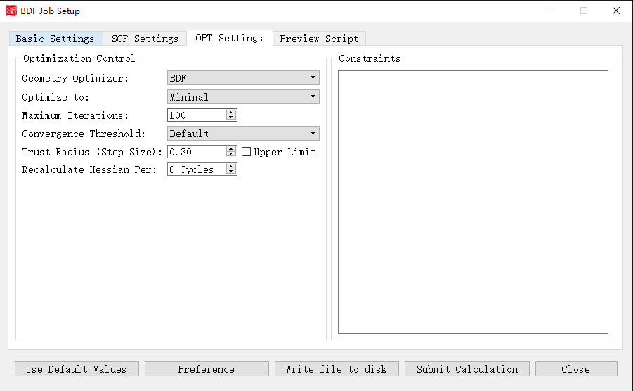

.. _run-bdfgui:

图形界面
************************************

本章将介绍BDF图形界面的功能和使用的注意事项。

初始参数界面
================================================

.. figure:: images/Basic-Tab.png
   :width: 800
   :align: center

上图是启动BDF任务提交界面的初始参数界面，这儿我们以甲烷分子 :math:`\ce{CH4}` 作为计算对象。

当我们导入分子结构之后，程序首先会识别分子的化学式、电荷数、对称点群等信息。并且根据这些信息来完成一些默认的设置，如Job Title输入框的内容、Input Filename的输入框内容、Multiplicity的输入框内容、Point Group的下拉框选项等。

下面我们对上图的图形界面的控件及其功能一一说明：

1. Job Title：计算任务的标题说明，一般用于备注当前计算的任务类型、分子体系和参数等等。这部分内容并不影响BDF的计算，但是为了养成良好的习惯，也方便将来查询，用户可根据自己的习惯进行一定的备注。例如对于单点能计算，笔者习惯将其备注成 ``SP_CH4_B3LYP-D3/6-31g**`` 。

2. Input Filename：计算任务的文件名，该输入框限制只能输入数字、字母、下划线（_）、加号（+）和减号（-）。例如当前输入为 ``CH4`` ，则软件会自动保存输入文件为 ``CH4.inp`` 。

3. Calculation Type：计算任务的类型，当前的图形界面支持 **Single Point（单点能计算）**、 **Optimization（结构优化）**、 **Frequency（频率计算）**、 **Opt+Freq（结构优化+频率计算）**、 **TDDFT（激发态计算）**、 **TDDFT-SOC（自旋轨道耦合计算）**、 **TDDFT-NAC（非绝热耦合计算）**、 **TDDFT-OPT（激发态结构优化）**、 **TDDFT-OPT（激发态频率计算）**、 **TDDFT-OPT+Freq（激发态结构优化+频率计算）**、 **NMR（核磁共振）** 共计11种计算类型。每一种计算类型都有相关的设置参数，选择对应的计算任务类型之后，程序会激活相应的控制模块。

4. Hamiltonian：计算任务考虑相对论效应时采用的哈密顿量，BDF支持多种相对论效应的计算，具体细节参见 :doc:`Introduction`，考虑到大部分用户的使用习惯和理论基础，当前的图形界面只提供了 **Non-relativistic（非相对论）**， **ECP（赝势）**， **sf-X2C** 和 **X2C** 四种选项。其中 **X2C** 尚未在当前发布的BDF版本中支持，故界面上不允许用户选择，在未来BDF软件更新相关功能之后才会解锁。 **Non-relativistic** 选项表示不考虑相对论效应，此时的哈密顿量也就是我们在教科书上见到的薛定谔方程的形式。 **ECP** 选项表示通过赝势基组的形式考虑相对论效应， **sf-X2C** 表示用无自旋的X2C二分量哈密顿考虑标量相对论效应。

5. Method后面有多个界面控件，第一个下拉选框是计算方法，支持 **Hartree-Fock** , **Korn-Sharm** 和 **MP2** 三种方法，其中 **MP2** 方法当前只支持单点能的计算。第一个下拉选框是计算体系的壳层设置，包括了 **Restricted（闭壳层）** ， **Unrestricted（开壳层）** 和 **Restricted Open（限制性开壳层）** 三种选择，当体系的自旋多重度等于1的时候，默认选择 **Restricted** ，如果用户要做自旋极化单重态的计算，可以选择 **Unrestricted**，并读取三重态计算的波函数作为初猜。 **Use iOI-SCF** 和  **Use FLMO-SCF** 这两个复选框可以选择BDF独有的通过分子分片方法进行大体系自洽场计算的方法，具体的技术细节可以参考 :doc:`FLMOMethod`。由于BDF软件现在只支持用iOI或者FLMO方法做单点的自洽场计算，如果用户要做大体系的结构优化，可以先采用iOI或者FLMO方法先做自洽场计算，然后再读取这一步得到的波函数作为初猜，用常规的HF方法或者DFT方法进行后续的梯度和结构优化计算。

6. Functional：Korn-Sharm计算采用的具体的泛函类型，只有在前面的Method下拉选项为Korn-Sharm的时候才会显示这个界面选项。由于BDF内置的泛函对梯度、激发态响应等支持程度各不相同，为了防止用户选择的泛函和具体的计算任务不匹配，软件会根据用户前面选择的任务类型，只列出支持对应计算的泛函选项。如果该泛函支持D3色散校正，则还会出现 **Use Dispersion Correction** 的复选框，如果勾选该复选框，则表示使用D3色散校正。

7. Basis：计算任务的基组，软件支持全电子基组、赝势基组和自定义混合基组三种选择。如果前面的相对论效应选择的了sf-X2C等全电子相对论计算方法，则此处只能选择专门为相对论计算优化的收缩基组或这些基组的混合形式。PS：def2系列的基组对于轻元素采用的是全电子基组、而对于重元素采用的是赝势基组，这儿根据用户的使用习惯将其放在了非相对论的全电子基组类型中。

8. Charge：计算体系的净电荷数目。

9. Multiplicity：计算体系的自旋多重度。

10. Solvent Model：溶剂化模型。

11. Point Group：分子的对称点群。

自洽场计算参数界面
================================================

.. figure:: images/SCF-Tab.png
   :width: 800
   :align: center

上图是启动BDF任务提交界面的自洽场计算参数界面。

下面我们对上图的图形界面的控件及其功能一一说明：

1. Initial Guess：指定自洽场计算的初始猜测的类型。下拉框支持 **Atom（利用原子密度矩阵组合分子密度矩阵猜测）** ， **Huckel（半经验Huckel方法猜测）** ， **Hcore（对角化单电子哈密顿猜测）** ， **Read（读入分子轨道做为初始猜测）** 四种类型，一般情况下 **atom** 较 **Hcore** 、 **Huckel** 好，因此正常情况下无需选择 **Hcore** 或 **Huckel** 。

2. Maximum Iterations:定义SCF计算的最大迭代次数。

3. Convergence Threshold:同时指定SCF收敛的能量和密度矩阵阈值。下拉框支持 **Very Tight** , **Tight** , **Default** , **Loose** , **Very Loose** 五种。 **Default** 表示1.0D-7 5.0D-5， **Very Tight** 表示1.0D-10 5.0D-8， **Tight** 表示1.0D-9 5.0D-7， **Loose** 表示1.0D-7 5.0D-5， **Very Loose** 表示1.0D-6 5.0D-4。

4. DFT Integral Grid:指定DFT计算的格点类型。下拉框支持 **Default** , **Ultra Coarse** , **Coarse** , **Medium** , **Fine** , **Ultra Fine** 六种。仅当初始参数界面-Method选择Kohn-Sham计算之后，才会显示这个界面选项。

5. Level Shift:指定分子轨道能级移动值，对应的scf模块的Vshift参数。人为地将虚轨道能量加上用户指定数值，以加大HOMO-LUMO能隙，加速收敛。Vshift值越大，收敛过程越不容易出现振荡，但Vshift值太大会导致收敛变慢。一般只有在分子的HOMO-LUMO能隙较小（如小于2 eV），且SCF迭代时能量非单调降低时，才需要设置Vshift。

6. Damping:指定本次SCF迭代与上次迭代的密度矩阵以一定比例混合（P(i):=(1-C)*P(i)+C*P(i-1)），从而加速SCF收敛，对应scf模块的Damp参数。Damp值越大，收敛过程越不容易出现振荡，但Damp值太大会导致收敛变慢。一般只有在SCF迭代能量非单调降低的时候，才需要设置Damp。

7. Fermi Smearing Temperature:指定体系的电子温度，也即通过费米展宽（Fermi Smearing）方法改变前线轨道的占据数。该界面选项受前面的Level Shift（即Vshift参数）控制，当Vshift>0时，冻结该界面选项，且该界面选项值为0；当Vshift=0时才激活该界面选项。此外，该界面选项也不可在大分子体系的FLMO或iOI计算中使用。

8. Use MPEC+COSX Acceleration：指定利用多级展开库伦势（Multipole expansion of Coulomb potential, MPEC）方法计算J矩阵， COSX（Chain-of-sphere exchange）方法计算K矩阵。

9. Disable DIIS Acceleration:指定不使用DIIS加速SCF收敛。一般只有在SCF能量以较大幅度（> 1.d-5）振荡不收敛，且scf模块的Damp和Vshift参数效果不明显时，才需要指定该界面复选框。

10. Print Molecular Orbital:控制是否打印分子轨道系数。下拉框支持 **Frontier Orbitals(不打印分子轨道)** , **Energy & Occupation(打印前线轨道（每个不可约表示的HOMO-5到LUMO+5）的占据数、能量、系数；若设为2)** , **All Information(打印所有轨道的占据数、能量、系数)** 三种。

11. Save Atomic Orbitals：计算并存储原子轨道。

12. Output SCF Orbitals：输出SCF收敛轨道，不勾选该界面复选框，则表示强制不将分子轨道存入.scforb文件。

13. Output SCF Orbitals in Pyscf format：控制将SCF收敛轨道存储为Pyscf轨道格式。

14. Output SCF Orbitals in Molden format：控制将分子轨道输出为Molden格式，以做后续的波函数分析。

结构优化计算参数界面
================================================

上图是启动BDF任务提交界面的结构优化计算参数界面。

下面我们对上图的图形界面的控件及其功能一一说明：

1. Geometry Optimizer:"DL-Find","BDF"
2. Optimize to:其中"Minimal","Transition State"
3. Maximum Iterations:
4. Convergence Threshold:其中Very Tight","Tight","Default","Loose","Very Loose"
5. Trust Radius (Step Size):   Upper Limit控件
6. Recalculate Hessian Per:
7. Constraints：

频率计算参数界面
================================================

上图是启动BDF任务提交界面的频率计算参数界面。

下面我们对上图的图形界面的控件及其功能一一说明：

1. Temperature:
2. Pressure:
3. Harmonic Correction Factor:
4. Degree of Degeneracy:

激发态计算参数界面
================================================

上图是启动BDF任务提交界面的激发态计算参数界面。

下面我们对上图的图形界面的控件及其功能一一说明：

1. Method:
2. Multiplicity:  Delta Ms:
3. Number of Excited States:
4. Target State:
5. Convergence Threshold:
6. Set Excitation Energy Window:
7. Use iVI method
8. Use MPEC+COSX Acceleration
9. Perform NTO Analysis
10. Localize Excited State:
11. Calculate Dipole Moments of Target State

分子轨道局域化参数界面
================================================

.. figure:: images/MO-Tab.png
   :width: 800
   :align: center

上图是启动BDF任务提交界面的分子轨道局域化参数界面。

下面我们对上图的图形界面的控件及其功能一一说明：

1. Localization Method:其中"Boys (Default)","Modified Boys","Four-center moment","Pipek-Mezey"
2. Exponential Factor:
3. Atomic Charge:其中"Mulliken","Lowdin"
4. Pipek-Mezey Method:其中"Jacobi Sweep","Trust Region"
5. Maximum Iterations:
6. Localize ROHF/ROKS Orbitals：
7. Localize MCSCF Orbitals
8. Project LMO to pFLMO
9. Print coefficients of LMOs

自旋轨道耦合计算参数界面
================================================

上图是启动BDF任务提交界面的自旋轨道耦合计算参数界面，即Spin-Orbit Coupling部分参数。

下面我们对上图的图形界面的控件及其功能一一说明：

1. Including Ground State：
2. Print Spin-orbit Matrix
3. Print Transition Dipole Between Scalar States
4. Print Transition Dipole Between Spinor States

非绝热耦合计算参数界面
================================================

上图是启动BDF任务提交界面的非绝热耦合计算参数界面，即Non-Adiabatic Coupling部分参数。

下面我们对上图的图形界面的控件及其功能一一说明：

1. Coupling Between::其中"Ground and Excited-State","Two Excited-States","Irrep 1","State 1","Irrep 2","State 2"

